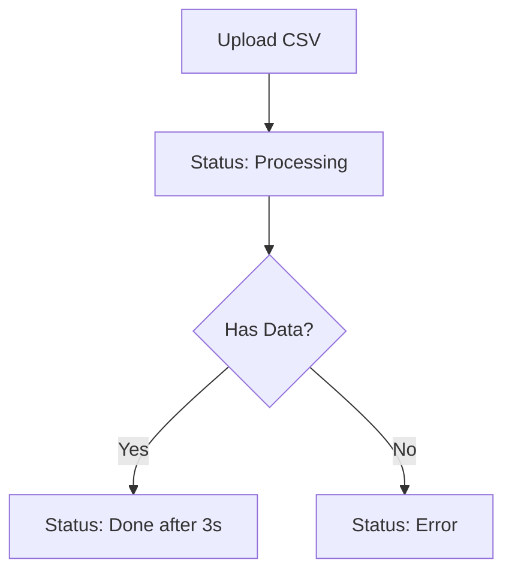

# Frontend Integration Guide

## CSV to Parquet Converter API

This document provides everything frontend developers need to integrate with the CSV to Parquet Converter API seamlessly.

---

## 🌐 **Base URL & Environment**

| Environment | Base URL                  | Notes                      |
| ----------- | ------------------------- | -------------------------- |
| Development | `http://localhost:8000`   | Default dev server         |
| Production  | `https://your-domain.com` | Replace with actual domain |

---

## 🔐 **Authentication Flow**

### **Step 1: Login**

```javascript
// POST /login
const loginResponse = await fetch("http://localhost:8000/login", {
  method: "POST",
  headers: {
    "Content-Type": "application/json",
  },
  body: JSON.stringify({
    username: "test",
    password: "password",
  }),
});

const authData = await loginResponse.json();
// Response: { access_token: "eyJ...", token_type: "bearer", message: "Login successful" }
```

### **Step 2: Store Token**

```javascript
// Store token for subsequent requests
localStorage.setItem("accessToken", authData.access_token);
```

### **Step 3: Use Token in Requests**

```javascript
const token = localStorage.getItem("accessToken");

const response = await fetch("http://localhost:8000/files", {
  headers: {
    Authorization: `Bearer ${token}`,
    "Content-Type": "application/json",
  },
});
```

---

## 📁 **API Endpoints Reference**

### **Authentication**

#### `POST /login`

**Purpose:** Authenticate user and get access token

**Request:**

```json
{
  "username": "test",
  "password": "password"
}
```

**Success Response (200):**

```json
{
  "access_token": "eyJhbGciOiJIUzI1NiIsInR5cCI6IkpXVCJ9...",
  "token_type": "bearer",
  "message": "Login successful"
}
```

**Error Response (401):**

```json
{
  "detail": "Incorrect username or password"
}
```

---

### **File Operations**

#### `POST /upload`

**Purpose:** Upload CSV file for conversion

**Request:**

```javascript
const formData = new FormData();
formData.append("file", csvFile); // File object from input

const response = await fetch("http://localhost:8000/upload", {
  method: "POST",
  headers: {
    Authorization: `Bearer ${token}`,
  },
  body: formData,
});
```

**Success Response (200):**

```json
{
  "id": 1,
  "filename": "employees.csv",
  "upload_timestamp": "2024-01-15T10:30:00",
  "row_count": 150,
  "status": "Processing",
  "parquet_path": "parquet/employees.parquet"
}
```

**Error Responses:**

```json
// 400 - Invalid file type
{
  "detail": "Only CSV files are allowed"
}

// 400 - Empty file
{
  "detail": "File is empty"
}

// 401 - Unauthorized
{
  "detail": "Invalid authentication credentials"
}
```

#### `GET /files`

**Purpose:** Get all uploaded files

**Response (200):**

```json
[
  {
    "id": 1,
    "filename": "employees.csv",
    "upload_timestamp": "2024-01-15T10:30:00",
    "row_count": 150,
    "status": "Done",
    "parquet_path": "parquet/employees.parquet"
  },
  {
    "id": 2,
    "filename": "products.csv",
    "upload_timestamp": "2024-01-15T11:00:00",
    "row_count": 25,
    "status": "Processing",
    "parquet_path": "parquet/products.parquet"
  }
]
```

#### `GET /files/{file_id}`

**Purpose:** Get specific file metadata

**Response (200):**

```json
{
  "id": 1,
  "filename": "employees.csv",
  "upload_timestamp": "2024-01-15T10:30:00",
  "row_count": 150,
  "status": "Done",
  "parquet_path": "parquet/employees.parquet"
}
```

**Error Response (404):**

```json
{
  "detail": "File not found"
}
```

#### `DELETE /files/{file_id}`

**Purpose:** Delete file and its metadata

**Response (200):**

```json
{
  "message": "File deleted successfully"
}
```

---

### **System Endpoints**

#### `GET /health`

**Purpose:** Check API health (no auth required)

**Response (200):**

```json
{
  "status": "healthy",
  "timestamp": "2024-01-15T10:30:00",
  "service": "CSV to Parquet Converter API"
}
```

#### `GET /`

**Purpose:** API information (no auth required)

**Response (200):**

```json
{
  "message": "CSV to Parquet Converter API",
  "version": "1.0.0",
  "docs": "/docs",
  "health": "/health"
}
```

---

## 🎯 **File Status Flow**

Understanding the file processing lifecycle:



**Status Values:**

- `"Processing"` - File is being converted (shows for 3 seconds)
- `"Done"` - Conversion completed successfully
- `"Error"` - File was empty or had parsing errors

---

## 💻 **Frontend Implementation Examples**

### **React Hook for API Integration**

```jsx
// hooks/useAPI.js
import { useState, useEffect } from "react";

export const useAPI = () => {
  const [token, setToken] = useState(localStorage.getItem("accessToken"));
  const [isAuthenticated, setIsAuthenticated] = useState(!!token);

  const apiCall = async (endpoint, options = {}) => {
    const url = `http://localhost:8000${endpoint}`;
    const config = {
      headers: {
        "Content-Type": "application/json",
        ...(token && { Authorization: `Bearer ${token}` }),
        ...options.headers,
      },
      ...options,
    };

    try {
      const response = await fetch(url, config);

      if (response.status === 401) {
        // Token expired or invalid
        logout();
        throw new Error("Authentication failed");
      }

      if (!response.ok) {
        const error = await response.json();
        throw new Error(error.detail || "API request failed");
      }

      return await response.json();
    } catch (error) {
      console.error("API Error:", error);
      throw error;
    }
  };

  const login = async (username, password) => {
    try {
      const data = await apiCall("/login", {
        method: "POST",
        body: JSON.stringify({ username, password }),
      });

      setToken(data.access_token);
      localStorage.setItem("accessToken", data.access_token);
      setIsAuthenticated(true);
      return data;
    } catch (error) {
      throw error;
    }
  };

  const logout = () => {
    setToken(null);
    localStorage.removeItem("accessToken");
    setIsAuthenticated(false);
  };

  return {
    apiCall,
    login,
    logout,
    isAuthenticated,
    token,
  };
};
```

### **File Upload Component**

```jsx
// components/FileUpload.jsx
import React, { useState } from "react";
import { useAPI } from "../hooks/useAPI";

const FileUpload = ({ onUploadSuccess }) => {
  const [file, setFile] = useState(null);
  const [uploading, setUploading] = useState(false);
  const [error, setError] = useState(null);
  const { apiCall } = useAPI();

  const handleFileChange = (e) => {
    const selectedFile = e.target.files[0];

    // Validate file type
    if (selectedFile && !selectedFile.name.endsWith(".csv")) {
      setError("Only CSV files are allowed");
      return;
    }

    // Validate file size (optional)
    if (selectedFile && selectedFile.size > 100 * 1024 * 1024) {
      // 100MB
      setError("File size must be less than 100MB");
      return;
    }

    setFile(selectedFile);
    setError(null);
  };

  const handleUpload = async () => {
    if (!file) {
      setError("Please select a file");
      return;
    }

    setUploading(true);
    setError(null);

    try {
      const formData = new FormData();
      formData.append("file", file);

      const result = await apiCall("/upload", {
        method: "POST",
        body: formData,
        headers: {}, // Remove Content-Type to let browser set it for FormData
      });

      onUploadSuccess?.(result);
      setFile(null);

      // Reset file input
      const fileInput = document.getElementById("file-input");
      if (fileInput) fileInput.value = "";
    } catch (err) {
      setError(err.message);
    } finally {
      setUploading(false);
    }
  };

  return (
    <div className="file-upload">
      <input
        id="file-input"
        type="file"
        accept=".csv"
        onChange={handleFileChange}
        disabled={uploading}
      />

      {file && (
        <div className="file-info">
          <p>
            Selected: {file.name} ({(file.size / 1024).toFixed(1)} KB)
          </p>
        </div>
      )}

      <button onClick={handleUpload} disabled={!file || uploading}>
        {uploading ? "Uploading..." : "Upload CSV"}
      </button>

      {error && <div className="error">{error}</div>}
    </div>
  );
};

export default FileUpload;
```

### **File List Component**

```jsx
// components/FileList.jsx
import React, { useState, useEffect } from "react";
import { useAPI } from "../hooks/useAPI";

const FileList = () => {
  const [files, setFiles] = useState([]);
  const [loading, setLoading] = useState(true);
  const [error, setError] = useState(null);
  const { apiCall } = useAPI();

  const fetchFiles = async () => {
    try {
      setLoading(true);
      const data = await apiCall("/files");
      setFiles(data);
    } catch (err) {
      setError(err.message);
    } finally {
      setLoading(false);
    }
  };

  const deleteFile = async (fileId) => {
    try {
      await apiCall(`/files/${fileId}`, { method: "DELETE" });
      setFiles(files.filter((file) => file.id !== fileId));
    } catch (err) {
      alert(`Error deleting file: ${err.message}`);
    }
  };

  const getStatusBadge = (status) => {
    const statusColors = {
      Processing: "orange",
      Done: "green",
      Error: "red",
    };

    return (
      <span
        className={`status-badge status-${status.toLowerCase()}`}
        style={{ color: statusColors[status] }}
      >
        {status}
      </span>
    );
  };

  useEffect(() => {
    fetchFiles();
  }, []);

  if (loading) return <div>Loading files...</div>;
  if (error) return <div>Error: {error}</div>;

  return (
    <div className="file-list">
      <h2>Uploaded Files</h2>

      {files.length === 0 ? (
        <p>No files uploaded yet.</p>
      ) : (
        <table>
          <thead>
            <tr>
              <th>Filename</th>
              <th>Upload Time</th>
              <th>Rows</th>
              <th>Status</th>
              <th>Actions</th>
            </tr>
          </thead>
          <tbody>
            {files.map((file) => (
              <tr key={file.id}>
                <td>{file.filename}</td>
                <td>{new Date(file.upload_timestamp).toLocaleString()}</td>
                <td>{file.row_count}</td>
                <td>{getStatusBadge(file.status)}</td>
                <td>
                  <button
                    onClick={() => deleteFile(file.id)}
                    className="delete-btn"
                  >
                    Delete
                  </button>
                </td>
              </tr>
            ))}
          </tbody>
        </table>
      )}

      <button onClick={fetchFiles}>Refresh</button>
    </div>
  );
};

export default FileList;
```

---

## 🚨 **Error Handling**

### **HTTP Status Codes**

| Code | Meaning      | Action                     |
| ---- | ------------ | -------------------------- |
| 200  | Success      | Process response data      |
| 400  | Bad Request  | Show error message to user |
| 401  | Unauthorized | Redirect to login          |
| 404  | Not Found    | Show "resource not found"  |
| 500  | Server Error | Show generic error message |

### **Error Response Format**

All errors follow this structure:

```json
{
  "detail": "Human-readable error message"
}
```

### **Frontend Error Handling Example**

```javascript
const handleAPIError = (error, response) => {
  switch (response.status) {
    case 401:
      // Redirect to login
      logout();
      window.location.href = "/login";
      break;
    case 400:
      // Show validation error
      setFormError(error.detail);
      break;
    case 404:
      // Show not found message
      setError("Resource not found");
      break;
    default:
      // Generic error
      setError("Something went wrong. Please try again.");
  }
};
```

---

## 🔄 **Real-time Updates**

For status updates (Processing → Done), you have two options:

### **Option 1: Polling**

```javascript
const pollFileStatus = async (fileId) => {
  const checkStatus = async () => {
    try {
      const file = await apiCall(`/files/${fileId}`);

      if (file.status === "Done" || file.status === "Error") {
        // Stop polling
        return file;
      }

      // Continue polling every 2 seconds
      setTimeout(checkStatus, 2000);
    } catch (error) {
      console.error("Polling error:", error);
    }
  };

  checkStatus();
};
```

### **Option 2: Periodic Refresh**

```javascript
useEffect(() => {
  const interval = setInterval(() => {
    fetchFiles(); // Refresh file list every 5 seconds
  }, 5000);

  return () => clearInterval(interval);
}, []);
```

---

## 🎨 **UI/UX Recommendations**

### **Loading States**

- Show spinners during API calls
- Disable buttons during uploads
- Display progress for large files

### **File Upload UX**

- Drag & drop support
- File type validation
- Size limit warnings
- Upload progress indicators

### **Status Indicators**

```css
.status-badge {
  padding: 4px 8px;
  border-radius: 4px;
  font-size: 12px;
  font-weight: bold;
}

.status-processing {
  background-color: #fff3cd;
  color: #856404;
}

.status-done {
  background-color: #d4edda;
  color: #155724;
}

.status-error {
  background-color: #f8d7da;
  color: #721c24;
}
```

---

## 🔧 **Configuration**

### **Environment Variables**

```javascript
// config.js
export const API_CONFIG = {
  BASE_URL: process.env.REACT_APP_API_URL || "http://localhost:8000",
  TIMEOUT: 30000, // 30 seconds
  MAX_FILE_SIZE: 100 * 1024 * 1024, // 100MB
};
```

### **API Client Setup**

```javascript
// api/client.js
export class APIClient {
  constructor(baseURL = API_CONFIG.BASE_URL) {
    this.baseURL = baseURL;
    this.timeout = API_CONFIG.TIMEOUT;
  }

  async request(endpoint, options = {}) {
    const url = `${this.baseURL}${endpoint}`;
    const config = {
      timeout: this.timeout,
      headers: {
        "Content-Type": "application/json",
      },
      ...options,
    };

    const controller = new AbortController();
    const timeoutId = setTimeout(() => controller.abort(), this.timeout);

    try {
      const response = await fetch(url, {
        ...config,
        signal: controller.signal,
      });

      clearTimeout(timeoutId);

      if (!response.ok) {
        const error = await response.json();
        throw new APIError(error.detail, response.status);
      }

      return await response.json();
    } catch (error) {
      clearTimeout(timeoutId);
      throw error;
    }
  }
}

class APIError extends Error {
  constructor(message, status) {
    super(message);
    this.status = status;
    this.name = "APIError";
  }
}
```

---

## 🧪 **Testing Integration**

### **Mock API Responses**

```javascript
// tests/mocks/api.js
export const mockAPIResponses = {
  login: {
    success: {
      access_token: "mock-token",
      token_type: "bearer",
      message: "Login successful",
    },
  },
  files: [
    {
      id: 1,
      filename: "test.csv",
      upload_timestamp: "2024-01-15T10:30:00",
      row_count: 100,
      status: "Done",
      parquet_path: "parquet/test.parquet",
    },
  ],
};
```

---

## 📋 **Checklist for Frontend Integration**

### **Authentication**

- [ ] Login form with username/password
- [ ] Token storage (localStorage/sessionStorage)
- [ ] Automatic token inclusion in requests
- [ ] Logout functionality
- [ ] Token expiration handling

### **File Operations**

- [ ] File upload with validation
- [ ] File list display
- [ ] Status indicators
- [ ] Delete functionality
- [ ] Error handling

### **User Experience**

- [ ] Loading states
- [ ] Error messages
- [ ] Success notifications
- [ ] Responsive design
- [ ] Accessibility features

### **Error Handling**

- [ ] Network errors
- [ ] Authentication errors
- [ ] Validation errors
- [ ] Server errors
- [ ] User feedback

---

## 🚀 **Quick Start Template**

```jsx
// App.jsx
import React from "react";
import { useAPI } from "./hooks/useAPI";
import Login from "./components/Login";
import Dashboard from "./components/Dashboard";

function App() {
  const { isAuthenticated } = useAPI();

  return (
    <div className="App">{isAuthenticated ? <Dashboard /> : <Login />}</div>
  );
}

export default App;
```

This guide provides everything needed for seamless frontend integration! 🎉
