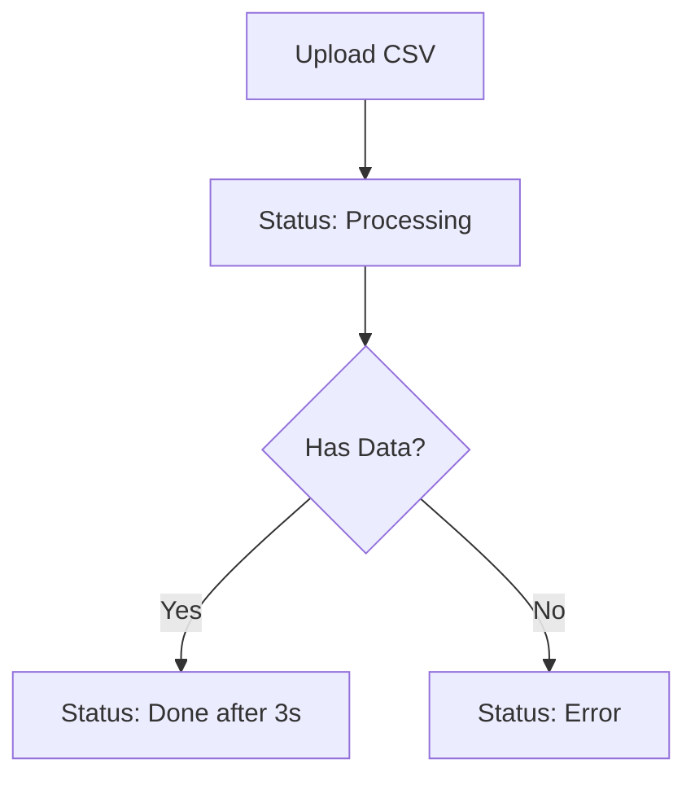

# Frontend Integration Guide

## CSV to Parquet Converter API v2.0

This document provides everything frontend developers need to integrate with the enhanced CSV to Parquet Converter API with cloud storage, advanced analytics, and dashboard features.

---

## 🌐 **Base URL & Environment**

| Environment | Base URL                                 | Notes                        |
| ----------- | ---------------------------------------- | ---------------------------- |
| Development | `http://localhost:8000`                  | Default dev server           |
| Production  | `https://csv-converter-api.onrender.com` | Production Render deployment |

### **Storage Backend Information:**

- **Development**: Local filesystem + R2 cloud storage (configurable)
- **Production**: Cloudflare R2 cloud storage + PostgreSQL database

---

## 🔐 **Authentication Flow**

### **Step 1: Login**

```javascript
// POST /login
const loginResponse = await fetch("http://localhost:8000/login", {
  method: "POST",
  headers: {
    "Content-Type": "application/json",
  },
  body: JSON.stringify({
    username: "test",
    password: "password",
  }),
});

const authData = await loginResponse.json();
// Response: { access_token: "eyJ...", token_type: "bearer", message: "Login successful" }
```

### **Step 2: Store Token**

```javascript
// Store token for subsequent requests
localStorage.setItem("accessToken", authData.access_token);
```

### **Step 3: Use Token in Requests**

```javascript
const token = localStorage.getItem("accessToken");

const response = await fetch("http://localhost:8000/files", {
  headers: {
    Authorization: `Bearer ${token}`,
    "Content-Type": "application/json",
  },
});
```

---

## 📁 **API Endpoints Reference**

### **Authentication**

#### `POST /login`

**Purpose:** Authenticate user and get access token

**Request:**

```json
{
  "username": "test",
  "password": "password"
}
```

**Success Response (200):**

```json
{
  "access_token": "eyJhbGciOiJIUzI1NiIsInR5cCI6IkpXVCJ9...",
  "token_type": "bearer",
  "message": "Login successful"
}
```

**Error Response (401):**

```json
{
  "detail": "Incorrect username or password"
}
```

---

### **File Operations**

#### `POST /upload`

**Purpose:** Upload CSV file for conversion

**Request:**

```javascript
const formData = new FormData();
formData.append("file", csvFile); // File object from input

const response = await fetch("http://localhost:8000/upload", {
  method: "POST",
  headers: {
    Authorization: `Bearer ${token}`,
  },
  body: formData,
});
```

**Success Response (200):**

```json
{
  "id": 1,
  "filename": "employees.csv",
  "upload_timestamp": "2024-01-15T10:30:00",
  "row_count": 150,
  "status": "Processing",
  "parquet_path": "parquet/employees.parquet",
  "storage_type": "cloud",
  "storage_info": {
    "csv_path": "csv/employees.csv",
    "parquet_path": "parquet/employees.parquet",
    "storage_backend": "r2"
  }
}
```

**Error Responses:**

```json
// 400 - Invalid file type
{
  "detail": "Only CSV files are allowed"
}

// 400 - Empty file
{
  "detail": "File is empty"
}

// 401 - Unauthorized
{
  "detail": "Invalid authentication credentials"
}
```

#### `GET /files`

**Purpose:** Get all uploaded files

**Response (200):**

```json
[
  {
    "id": 1,
    "filename": "employees.csv",
    "upload_timestamp": "2024-01-15T10:30:00",
    "row_count": 150,
    "status": "Done",
    "parquet_path": "parquet/employees.parquet"
  },
  {
    "id": 2,
    "filename": "products.csv",
    "upload_timestamp": "2024-01-15T11:00:00",
    "row_count": 25,
    "status": "Processing",
    "parquet_path": "parquet/products.parquet"
  }
]
```

#### `GET /files/{file_id}`

**Purpose:** Get specific file metadata

**Response (200):**

```json
{
  "id": 1,
  "filename": "employees.csv",
  "upload_timestamp": "2024-01-15T10:30:00",
  "row_count": 150,
  "status": "Done",
  "parquet_path": "parquet/employees.parquet"
}
```

**Error Response (404):**

```json
{
  "detail": "File not found"
}
```

#### `GET /files/{file_id}/data`

**Purpose:** Get actual file data content with pagination

**Parameters:**

- `limit` (optional): Number of rows to return (default: 100)
- `offset` (optional): Number of rows to skip (default: 0)
- `format` (optional): Data format - "csv" or "parquet" (default: "parquet")

**Example Request:**

```javascript
const response = await fetch(
  `http://localhost:8000/files/1/data?limit=50&offset=0&format=parquet`,
  {
    headers: { Authorization: `Bearer ${token}` },
  }
);
```

**Success Response (200):**

```json
{
  "file_id": 1,
  "filename": "employees.csv",
  "format": "parquet",
  "total_rows": 150,
  "returned_rows": 50,
  "offset": 0,
  "limit": 50,
  "columns": ["id", "name", "email", "department", "salary"],
  "data": [
    {
      "id": 1,
      "name": "John Doe",
      "email": "john@company.com",
      "department": "Engineering",
      "salary": 75000
    },
    {
      "id": 2,
      "name": "Jane Smith",
      "email": "jane@company.com",
      "department": "Marketing",
      "salary": 65000
    }
  ]
}
```

#### `GET /files/{file_id}/statistics`

**Purpose:** Get comprehensive file analytics and statistics

**Success Response (200):**

```json
{
  "file_info": {
    "id": 1,
    "filename": "employees.csv",
    "upload_timestamp": "2024-01-15T10:30:00",
    "status": "Done",
    "total_rows": 150,
    "total_columns": 5
  },
  "columns": [
    {
      "name": "salary",
      "data_type": "int64",
      "missing_count": 2,
      "missing_percentage": 1.33,
      "unique_count": 120,
      "sample_values": [75000, 65000, 80000, 55000, 90000],
      "min_value": 35000,
      "max_value": 120000,
      "mean_value": 67500.0,
      "median_value": 65000
    },
    {
      "name": "department",
      "data_type": "object",
      "missing_count": 0,
      "missing_percentage": 0.0,
      "unique_count": 8,
      "sample_values": ["Engineering", "Marketing", "Sales", "HR", "Finance"]
    }
  ],
  "data_quality": {
    "total_missing_values": 5,
    "missing_percentage": 0.67,
    "duplicate_rows": 2,
    "unique_rows": 148
  },
  "file_sizes": {
    "csv_size_bytes": 12450,
    "parquet_size_bytes": 8230,
    "compression_ratio": 1.51
  }
}
```

#### `GET /files/{file_id}/preview`

**Purpose:** Get quick preview of both CSV and Parquet data

**Parameters:**

- `rows` (optional): Number of rows to preview (default: 10)

**Success Response (200):**

```json
{
  "file_id": 1,
  "filename": "employees.csv",
  "status": "Done",
  "rows_requested": 10,
  "csv_preview": {
    "columns": ["id", "name", "email", "department", "salary"],
    "data": [
      {
        "id": 1,
        "name": "John Doe",
        "email": "john@company.com",
        "department": "Engineering",
        "salary": 75000
      }
    ],
    "rows_returned": 10
  },
  "parquet_preview": {
    "columns": ["id", "name", "email", "department", "salary"],
    "data": [
      {
        "id": 1,
        "name": "John Doe",
        "email": "john@company.com",
        "department": "Engineering",
        "salary": 75000
      }
    ],
    "rows_returned": 10
  }
}
```

#### `GET /files/{file_id}/download`

**Purpose:** Generate secure download URL for Parquet/CSV files

**Parameters:**

- `format` (optional): File format - "csv" or "parquet" (default: "parquet")
- `expiration_hours` (optional): URL expiration time in hours 1-24 (default: 1)

**Example Request:**

```javascript
const response = await fetch(
  `http://localhost:8000/files/1/download?format=parquet&expiration_hours=6`,
  {
    headers: { Authorization: `Bearer ${token}` },
  }
);
```

**Success Response (200):**

```json
{
  "download_url": "https://your-account-id.r2.cloudflarestorage.com/csv-converter-storage/parquet/data.parquet?X-Amz-Algorithm=AWS4-HMAC-SHA256&X-Amz-Credential=...",
  "file_info": {
    "id": 1,
    "filename": "data.csv",
    "format": "parquet",
    "size_bytes": 8230,
    "size_mb": 0.008,
    "rows": 150
  },
  "url_info": {
    "expires_in_hours": 6,
    "expires_in_seconds": 21600,
    "storage_type": "cloud",
    "generated_at": "2024-01-15T15:30:00"
  }
}
```

#### `DELETE /files/{file_id}`

**Purpose:** Delete file and its metadata

**Response (200):**

```json
{
  "message": "File deleted successfully"
}
```

---

### **Dashboard Endpoints**

#### `GET /dashboard/overview`

**Purpose:** Get comprehensive dashboard metrics and analytics

**Success Response (200):**

```json
{
  "overview": {
    "total_files": 25,
    "processed_files": 23,
    "processing_files": 1,
    "error_files": 1,
    "success_rate_percentage": 92.0,
    "total_rows_processed": 45230,
    "average_rows_per_file": 1966
  },
  "storage": {
    "total_csv_size_bytes": 15680234,
    "total_parquet_size_bytes": 8945123,
    "space_saved_bytes": 6735111,
    "space_saved_percentage": 42.9,
    "compression_ratio": 1.75,
    "total_csv_size_mb": 14.95,
    "total_parquet_size_mb": 8.53
  },
  "recent_activity": {
    "files_this_week": 8,
    "rows_this_week": 12450,
    "latest_uploads": [
      {
        "filename": "quarterly_report.csv",
        "upload_time": "2024-01-15T14:30:00",
        "status": "Done",
        "rows": 2300
      }
    ]
  },
  "file_distribution": {
    "by_status": {
      "done": 23,
      "processing": 1,
      "error": 1
    },
    "largest_files": [
      {
        "filename": "customer_data.csv",
        "size_mb": 5.2,
        "rows": 8500,
        "upload_date": "2024-01-10T09:15:00"
      }
    ],
    "most_rows": [
      {
        "filename": "transaction_log.csv",
        "size_mb": 3.8,
        "rows": 12000,
        "upload_date": "2024-01-12T11:20:00"
      }
    ]
  },
  "performance": {
    "average_compression_ratio": 1.75,
    "total_storage_saved_mb": 6.42,
    "processing_efficiency": 92.0
  }
}
```

#### `GET /dashboard/activity`

**Purpose:** Get daily activity timeline for charts

**Parameters:**

- `days` (optional): Number of days to include (default: 30)

**Success Response (200):**

```json
{
  "activity_timeline": [
    {
      "date": "2024-01-15",
      "files_uploaded": 3,
      "files_processed": 3,
      "files_failed": 0,
      "total_rows": 4200,
      "total_size_mb": 2.3
    },
    {
      "date": "2024-01-14",
      "files_uploaded": 1,
      "files_processed": 1,
      "files_failed": 0,
      "total_rows": 1500,
      "total_size_mb": 0.8
    }
  ]
}
```

#### `GET /dashboard/data-quality`

**Purpose:** Get data quality metrics across all files

**Success Response (200):**

```json
{
  "total_files_analyzed": 23,
  "data_completeness": [
    {
      "filename": "employees.csv",
      "completeness_percentage": 98.67,
      "missing_values": 5,
      "total_cells": 750,
      "duplicate_rows": 2
    }
  ],
  "file_quality_scores": [
    {
      "filename": "employees.csv",
      "quality_score": 97.67,
      "rows": 150,
      "columns": 5
    }
  ]
}
```

#### `GET /dashboard/system-stats`

**Purpose:** Get system health and configuration information

**Success Response (200):**

```json
{
  "directories": {
    "uploads": {
      "exists": true,
      "file_count": 25,
      "total_size_bytes": 15680234,
      "total_size_mb": 14.95
    },
    "parquet": {
      "exists": true,
      "file_count": 23,
      "total_size_bytes": 8945123,
      "total_size_mb": 8.53
    }
  },
  "database": {
    "total_records": 25,
    "connection_status": "healthy"
  },
  "processing": {
    "supported_formats": ["CSV", "TSV", "TXT"],
    "supported_encodings": ["UTF-8", "Latin1", "CP1252", "ISO-8859-1"],
    "supported_delimiters": [
      "Comma",
      "Semicolon",
      "Tab",
      "Pipe",
      "Auto-detect"
    ],
    "max_file_size_mb": 100,
    "processing_timeout_seconds": 30
  },
  "api_info": {
    "version": "1.0.0",
    "uptime_check": "2024-01-15T15:30:00",
    "token_expiry_days": 7,
    "cors_enabled": true
  }
}
```

---

### **System Endpoints**

#### `GET /health`

**Purpose:** Check API health (no auth required)

**Response (200):**

```json
{
  "status": "healthy",
  "timestamp": "2024-01-15T10:30:00",
  "service": "CSV to Parquet Converter API"
}
```

#### `GET /`

**Purpose:** API information (no auth required)

**Response (200):**

```json
{
  "message": "CSV to Parquet Converter API",
  "version": "1.0.0",
  "docs": "/docs",
  "health": "/health"
}
```

---

## 🎯 **File Status Flow**

Understanding the file processing lifecycle:



**Status Values:**

- `"Processing"` - File is being converted (shows for 3 seconds)
- `"Done"` - Conversion completed successfully
- `"Error"` - File was empty or had parsing errors

---

## 💻 **Frontend Implementation Examples**

### **React Hook for API Integration**

```jsx
// hooks/useAPI.js
import { useState, useEffect } from "react";

export const useAPI = () => {
  const [token, setToken] = useState(localStorage.getItem("accessToken"));
  const [isAuthenticated, setIsAuthenticated] = useState(!!token);

  const apiCall = async (endpoint, options = {}) => {
    const url = `http://localhost:8000${endpoint}`;
    const config = {
      headers: {
        "Content-Type": "application/json",
        ...(token && { Authorization: `Bearer ${token}` }),
        ...options.headers,
      },
      ...options,
    };

    try {
      const response = await fetch(url, config);

      if (response.status === 401) {
        // Token expired or invalid
        logout();
        throw new Error("Authentication failed");
      }

      if (!response.ok) {
        const error = await response.json();
        throw new Error(error.detail || "API request failed");
      }

      return await response.json();
    } catch (error) {
      console.error("API Error:", error);
      throw error;
    }
  };

  const login = async (username, password) => {
    try {
      const data = await apiCall("/login", {
        method: "POST",
        body: JSON.stringify({ username, password }),
      });

      setToken(data.access_token);
      localStorage.setItem("accessToken", data.access_token);
      setIsAuthenticated(true);
      return data;
    } catch (error) {
      throw error;
    }
  };

  const logout = () => {
    setToken(null);
    localStorage.removeItem("accessToken");
    setIsAuthenticated(false);
  };

  return {
    apiCall,
    login,
    logout,
    isAuthenticated,
    token,
  };
};
```

### **File Upload Component**

```jsx
// components/FileUpload.jsx
import React, { useState } from "react";
import { useAPI } from "../hooks/useAPI";

const FileUpload = ({ onUploadSuccess }) => {
  const [file, setFile] = useState(null);
  const [uploading, setUploading] = useState(false);
  const [error, setError] = useState(null);
  const { apiCall } = useAPI();

  const handleFileChange = (e) => {
    const selectedFile = e.target.files[0];

    // Validate file type
    if (selectedFile && !selectedFile.name.endsWith(".csv")) {
      setError("Only CSV files are allowed");
      return;
    }

    // Validate file size (optional)
    if (selectedFile && selectedFile.size > 100 * 1024 * 1024) {
      // 100MB
      setError("File size must be less than 100MB");
      return;
    }

    setFile(selectedFile);
    setError(null);
  };

  const handleUpload = async () => {
    if (!file) {
      setError("Please select a file");
      return;
    }

    setUploading(true);
    setError(null);

    try {
      const formData = new FormData();
      formData.append("file", file);

      const result = await apiCall("/upload", {
        method: "POST",
        body: formData,
        headers: {}, // Remove Content-Type to let browser set it for FormData
      });

      onUploadSuccess?.(result);
      setFile(null);

      // Reset file input
      const fileInput = document.getElementById("file-input");
      if (fileInput) fileInput.value = "";
    } catch (err) {
      setError(err.message);
    } finally {
      setUploading(false);
    }
  };

  return (
    <div className="file-upload">
      <input
        id="file-input"
        type="file"
        accept=".csv"
        onChange={handleFileChange}
        disabled={uploading}
      />

      {file && (
        <div className="file-info">
          <p>
            Selected: {file.name} ({(file.size / 1024).toFixed(1)} KB)
          </p>
        </div>
      )}

      <button onClick={handleUpload} disabled={!file || uploading}>
        {uploading ? "Uploading..." : "Upload CSV"}
      </button>

      {error && <div className="error">{error}</div>}
    </div>
  );
};

export default FileUpload;
```

### **File List Component**

```jsx
// components/FileList.jsx
import React, { useState, useEffect } from "react";
import { useAPI } from "../hooks/useAPI";

const FileList = () => {
  const [files, setFiles] = useState([]);
  const [loading, setLoading] = useState(true);
  const [error, setError] = useState(null);
  const { apiCall } = useAPI();

  const fetchFiles = async () => {
    try {
      setLoading(true);
      const data = await apiCall("/files");
      setFiles(data);
    } catch (err) {
      setError(err.message);
    } finally {
      setLoading(false);
    }
  };

  const deleteFile = async (fileId) => {
    try {
      await apiCall(`/files/${fileId}`, { method: "DELETE" });
      setFiles(files.filter((file) => file.id !== fileId));
    } catch (err) {
      alert(`Error deleting file: ${err.message}`);
    }
  };

  const getStatusBadge = (status) => {
    const statusColors = {
      Processing: "orange",
      Done: "green",
      Error: "red",
    };

    return (
      <span
        className={`status-badge status-${status.toLowerCase()}`}
        style={{ color: statusColors[status] }}
      >
        {status}
      </span>
    );
  };

  useEffect(() => {
    fetchFiles();
  }, []);

  if (loading) return <div>Loading files...</div>;
  if (error) return <div>Error: {error}</div>;

  return (
    <div className="file-list">
      <h2>Uploaded Files</h2>

      {files.length === 0 ? (
        <p>No files uploaded yet.</p>
      ) : (
        <table>
          <thead>
            <tr>
              <th>Filename</th>
              <th>Upload Time</th>
              <th>Rows</th>
              <th>Status</th>
              <th>Actions</th>
            </tr>
          </thead>
          <tbody>
            {files.map((file) => (
              <tr key={file.id}>
                <td>{file.filename}</td>
                <td>{new Date(file.upload_timestamp).toLocaleString()}</td>
                <td>{file.row_count}</td>
                <td>{getStatusBadge(file.status)}</td>
                <td>
                  <button
                    onClick={() => deleteFile(file.id)}
                    className="delete-btn"
                  >
                    Delete
                  </button>
                </td>
              </tr>
            ))}
          </tbody>
        </table>
      )}

      <button onClick={fetchFiles}>Refresh</button>
    </div>
  );
};

export default FileList;
```

---

## 🚨 **Error Handling**

### **HTTP Status Codes**

| Code | Meaning      | Action                     |
| ---- | ------------ | -------------------------- |
| 200  | Success      | Process response data      |
| 400  | Bad Request  | Show error message to user |
| 401  | Unauthorized | Redirect to login          |
| 404  | Not Found    | Show "resource not found"  |
| 500  | Server Error | Show generic error message |

### **Error Response Format**

All errors follow this structure:

```json
{
  "detail": "Human-readable error message"
}
```

### **Frontend Error Handling Example**

```javascript
const handleAPIError = (error, response) => {
  switch (response.status) {
    case 401:
      // Redirect to login
      logout();
      window.location.href = "/login";
      break;
    case 400:
      // Show validation error
      setFormError(error.detail);
      break;
    case 404:
      // Show not found message
      setError("Resource not found");
      break;
    default:
      // Generic error
      setError("Something went wrong. Please try again.");
  }
};
```

---

## 🔄 **Real-time Updates**

For status updates (Processing → Done), you have two options:

### **Option 1: Polling**

```javascript
const pollFileStatus = async (fileId) => {
  const checkStatus = async () => {
    try {
      const file = await apiCall(`/files/${fileId}`);

      if (file.status === "Done" || file.status === "Error") {
        // Stop polling
        return file;
      }

      // Continue polling every 2 seconds
      setTimeout(checkStatus, 2000);
    } catch (error) {
      console.error("Polling error:", error);
    }
  };

  checkStatus();
};
```

### **Option 2: Periodic Refresh**

```javascript
useEffect(() => {
  const interval = setInterval(() => {
    fetchFiles(); // Refresh file list every 5 seconds
  }, 5000);

  return () => clearInterval(interval);
}, []);
```

---

## 🎨 **UI/UX Recommendations**

### **Loading States**

- Show spinners during API calls
- Disable buttons during uploads
- Display progress for large files

### **File Upload UX**

- Drag & drop support
- File type validation
- Size limit warnings
- Upload progress indicators

### **Status Indicators**

```css
.status-badge {
  padding: 4px 8px;
  border-radius: 4px;
  font-size: 12px;
  font-weight: bold;
}

.status-processing {
  background-color: #fff3cd;
  color: #856404;
}

.status-done {
  background-color: #d4edda;
  color: #155724;
}

.status-error {
  background-color: #f8d7da;
  color: #721c24;
}
```

---

## 🔧 **Configuration**

### **Environment Variables**

```javascript
// config.js
export const API_CONFIG = {
  BASE_URL: process.env.REACT_APP_API_URL || "http://localhost:8000",
  TIMEOUT: 30000, // 30 seconds
  MAX_FILE_SIZE: 100 * 1024 * 1024, // 100MB
};
```

### **API Client Setup**

```javascript
// api/client.js
export class APIClient {
  constructor(baseURL = API_CONFIG.BASE_URL) {
    this.baseURL = baseURL;
    this.timeout = API_CONFIG.TIMEOUT;
  }

  async request(endpoint, options = {}) {
    const url = `${this.baseURL}${endpoint}`;
    const config = {
      timeout: this.timeout,
      headers: {
        "Content-Type": "application/json",
      },
      ...options,
    };

    const controller = new AbortController();
    const timeoutId = setTimeout(() => controller.abort(), this.timeout);

    try {
      const response = await fetch(url, {
        ...config,
        signal: controller.signal,
      });

      clearTimeout(timeoutId);

      if (!response.ok) {
        const error = await response.json();
        throw new APIError(error.detail, response.status);
      }

      return await response.json();
    } catch (error) {
      clearTimeout(timeoutId);
      throw error;
    }
  }
}

class APIError extends Error {
  constructor(message, status) {
    super(message);
    this.status = status;
    this.name = "APIError";
  }
}
```

---

## 🧪 **Testing Integration**

### **Mock API Responses**

```javascript
// tests/mocks/api.js
export const mockAPIResponses = {
  login: {
    success: {
      access_token: "mock-token",
      token_type: "bearer",
      message: "Login successful",
    },
  },
  files: [
    {
      id: 1,
      filename: "test.csv",
      upload_timestamp: "2024-01-15T10:30:00",
      row_count: 100,
      status: "Done",
      parquet_path: "parquet/test.parquet",
    },
  ],
};
```

---

## 📋 **Checklist for Frontend Integration**

### **Authentication**

- [ ] Login form with username/password
- [ ] Token storage (localStorage/sessionStorage)
- [ ] Automatic token inclusion in requests
- [ ] Logout functionality
- [ ] Token expiration handling

### **File Operations**

- [ ] File upload with validation
- [ ] File list display
- [ ] Status indicators
- [ ] Delete functionality
- [ ] Error handling

### **User Experience**

- [ ] Loading states
- [ ] Error messages
- [ ] Success notifications
- [ ] Responsive design
- [ ] Accessibility features

### **Error Handling**

- [ ] Network errors
- [ ] Authentication errors
- [ ] Validation errors
- [ ] Server errors
- [ ] User feedback

---

## 🚀 **Quick Start Template**

```jsx
// App.jsx
import React from "react";
import { useAPI } from "./hooks/useAPI";
import Login from "./components/Login";
import Dashboard from "./components/Dashboard";

function App() {
  const { isAuthenticated } = useAPI();

  return (
    <div className="App">{isAuthenticated ? <Dashboard /> : <Login />}</div>
  );
}

export default App;
```

---

## 📋 **Final Data Models & TypeScript Definitions**

### **FileMetadata Model**

```typescript
interface FileMetadata {
  id: number;
  filename: string;
  upload_timestamp: string; // ISO datetime string
  row_count: number;
  status: "Processing" | "Done" | "Error";
  parquet_path: string | null;
}
```

### **Upload Response Model**

```typescript
interface UploadResponse {
  id: number;
  filename: string;
  upload_timestamp: string;
  row_count: number;
  status: "Processing" | "Done" | "Error";
  parquet_path: string | null;
  storage_type: "cloud" | "local";
  storage_info: {
    csv_path: string;
    parquet_path: string | null;
    storage_backend: "r2" | "local_filesystem";
  };
}
```

### **File Data Response Model**

```typescript
interface FileDataResponse {
  file_id: number;
  filename: string;
  format: "csv" | "parquet";
  total_rows: number;
  returned_rows: number;
  offset: number;
  limit: number;
  columns: string[];
  data: Record<string, any>[];
}
```

### **File Statistics Model**

```typescript
interface ColumnStatistics {
  name: string;
  data_type: string;
  missing_count: number;
  missing_percentage: number;
  unique_count: number;
  sample_values: any[];
  min_value?: number;
  max_value?: number;
  mean_value?: number;
  median_value?: number;
}

interface FileStatistics {
  file_info: {
    id: number;
    filename: string;
    upload_timestamp: string;
    status: string;
    total_rows: number;
    total_columns: number;
  };
  columns: ColumnStatistics[];
  data_quality: {
    total_missing_values: number;
    missing_percentage: number;
    duplicate_rows: number;
    unique_rows: number;
  };
  file_sizes: {
    csv_size_bytes: number;
    parquet_size_bytes: number;
    compression_ratio: number;
  };
}
```

### **Dashboard Overview Model**

```typescript
interface DashboardOverview {
  overview: {
    total_files: number;
    processed_files: number;
    processing_files: number;
    error_files: number;
    success_rate_percentage: number;
    total_rows_processed: number;
    average_rows_per_file: number;
  };
  storage: {
    total_csv_size_bytes: number;
    total_parquet_size_bytes: number;
    space_saved_bytes: number;
    space_saved_percentage: number;
    compression_ratio: number;
    total_csv_size_mb: number;
    total_parquet_size_mb: number;
  };
  recent_activity: {
    files_this_week: number;
    rows_this_week: number;
    latest_uploads: {
      filename: string;
      upload_time: string;
      status: string;
      rows: number;
    }[];
  };
  file_distribution: {
    by_status: {
      done: number;
      processing: number;
      error: number;
    };
    largest_files: {
      filename: string;
      size_mb: number;
      rows: number;
      upload_date: string;
    }[];
    most_rows: {
      filename: string;
      size_mb: number;
      rows: number;
      upload_date: string;
    }[];
  };
  performance: {
    average_compression_ratio: number;
    total_storage_saved_mb: number;
    processing_efficiency: number;
  };
}
```

### **Complete API Client Class**

```typescript
class CSVConverterAPI {
  private baseURL: string;
  private token: string | null = null;

  constructor(baseURL: string = "http://localhost:8000") {
    this.baseURL = baseURL;
    this.token = localStorage.getItem("accessToken");
  }

  // Authentication
  async login(username: string, password: string): Promise<void> {
    const response = await this.request("/login", {
      method: "POST",
      body: JSON.stringify({ username, password }),
    });

    this.token = response.access_token;
    localStorage.setItem("accessToken", this.token);
  }

  logout(): void {
    this.token = null;
    localStorage.removeItem("accessToken");
  }

  // File Operations
  async uploadFile(file: File): Promise<UploadResponse> {
    const formData = new FormData();
    formData.append("file", file);

    return this.request("/upload", {
      method: "POST",
      body: formData,
      headers: {}, // Let browser set Content-Type for FormData
    });
  }

  async getFiles(): Promise<FileMetadata[]> {
    return this.request("/files");
  }

  async getFile(fileId: number): Promise<FileMetadata> {
    return this.request(`/files/${fileId}`);
  }

  async getFileData(
    fileId: number,
    options: {
      limit?: number;
      offset?: number;
      format?: "csv" | "parquet";
    } = {}
  ): Promise<FileDataResponse> {
    const params = new URLSearchParams();
    if (options.limit) params.set("limit", options.limit.toString());
    if (options.offset) params.set("offset", options.offset.toString());
    if (options.format) params.set("format", options.format);

    const url = params.toString()
      ? `/files/${fileId}/data?${params}`
      : `/files/${fileId}/data`;
    return this.request(url);
  }

  async getFileStatistics(fileId: number): Promise<FileStatistics> {
    return this.request(`/files/${fileId}/statistics`);
  }

  async getFilePreview(fileId: number, rows: number = 10): Promise<any> {
    return this.request(`/files/${fileId}/preview?rows=${rows}`);
  }

  async getDownloadUrl(
    fileId: number,
    options: {
      format?: "csv" | "parquet";
      expiration_hours?: number;
    } = {}
  ): Promise<any> {
    const params = new URLSearchParams();
    if (options.format) params.set("format", options.format);
    if (options.expiration_hours)
      params.set("expiration_hours", options.expiration_hours.toString());

    const url = params.toString()
      ? `/files/${fileId}/download?${params}`
      : `/files/${fileId}/download`;
    return this.request(url);
  }

  async deleteFile(fileId: number): Promise<void> {
    await this.request(`/files/${fileId}`, { method: "DELETE" });
  }

  // Dashboard
  async getDashboardOverview(): Promise<DashboardOverview> {
    return this.request("/dashboard/overview");
  }

  async getActivityTimeline(days: number = 30): Promise<any> {
    return this.request(`/dashboard/activity?days=${days}`);
  }

  async getDataQuality(): Promise<any> {
    return this.request("/dashboard/data-quality");
  }

  async getSystemStats(): Promise<any> {
    return this.request("/dashboard/system-stats");
  }

  // Health
  async getHealth(): Promise<any> {
    return this.request("/health");
  }

  // Private request method
  private async request(
    endpoint: string,
    options: RequestInit = {}
  ): Promise<any> {
    const url = `${this.baseURL}${endpoint}`;

    const config: RequestInit = {
      headers: {
        "Content-Type": "application/json",
        ...(this.token && { Authorization: `Bearer ${this.token}` }),
        ...options.headers,
      },
      ...options,
    };

    try {
      const response = await fetch(url, config);

      if (response.status === 401) {
        this.logout();
        throw new Error("Authentication failed");
      }

      if (!response.ok) {
        const error = await response.json();
        throw new Error(error.detail || "API request failed");
      }

      return await response.json();
    } catch (error) {
      console.error("API Error:", error);
      throw error;
    }
  }
}

// Usage Example
const api = new CSVConverterAPI("http://localhost:8000");

// Login
await api.login("test", "password");

// Upload file
const uploadResult = await api.uploadFile(csvFile);

// Get dashboard data
const dashboard = await api.getDashboardOverview();

// Get file data with pagination
const fileData = await api.getFileData(1, {
  limit: 50,
  offset: 0,
  format: "parquet",
});

// Get file statistics
const stats = await api.getFileStatistics(1);

// Generate download URL for Parquet file
const downloadInfo = await api.getDownloadUrl(1, {
  format: "parquet",
  expiration_hours: 6,
});

// Use the download URL
window.open(downloadInfo.download_url, "_blank");
```

---

## 🚀 **Enhanced Features in v2.0**

### **New Capabilities:**

- ✅ **Cloud Storage Integration** (Cloudflare R2)
- ✅ **Advanced Data Analytics** (statistics, quality metrics)
- ✅ **Dashboard API** (comprehensive metrics)
- ✅ **Robust CSV Processing** (multiple encodings, delimiters)
- ✅ **JSON Serialization** (handles NaN, Inf, complex types)
- ✅ **Production Database** (PostgreSQL with Neon)
- ✅ **Extended Token Expiry** (7 days)
- ✅ **Mixed Storage Support** (seamless local/cloud fallback)

### **Enhanced Error Handling:**

- Better file not found messages
- Storage location debugging
- Data type conversion safety
- Comprehensive validation

### **Performance Improvements:**

- Cloud storage optimization
- Efficient pagination
- Compressed file formats
- Connection pooling

This guide provides everything needed for seamless frontend integration! 🎉
